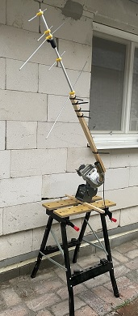
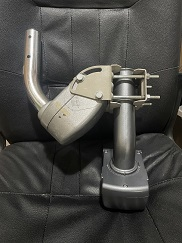

FrankenSaT
==========

FrankenSaT is abbreviation of <b>"Frankenstein" Satellite Tracker</b> - an affordable DIY antenna rotator with Azimuth (pan) and optional Elevation (tilt) controlled by [Hamlib](https://github.com/Hamlib/Hamlib)'s _rotctld_ protocol. Why "Frankenstein"? Like the [creature of the same name](https://en.wikipedia.org/wiki/Frankenstein%27s_monster) in a [literary novel](https://en.wikipedia.org/wiki/Frankenstein), this project is ultimately ugly - both software and construction part.

# Advantages

* **Price**: It can be made by anyone who has an old satellite receiver with [OpenATV Enigma2](https://github.com/openatv/enigma2) in a drawer and perhaps a [DiSEqC](https://en.wikipedia.org/wiki/DiSEqC) motor for a satellite dish alignment. If not, both can be found on sale at a total price lower than many other antenna pan/tilt solutions. Other parts are just common hardware store items, often already owned in shed/garage.
* **Low skill requirement**: No need to solder, all electronics is already assembled in the receiver. You just is upload a Bash script to the receiver and you will get Azimuth motor control. The same script can also control second motor for Elevation.
* **Carrying capacity**: Usually at least 10 kg per motor. When using two motors (one carries the second one), there are still several kg available for the antenna.
* **Weather proof**: Motors are designed to outdoor mount.
* **Optimal for "cliff" mount**: Angular span 150-160° of many motors seems to be enough for Azimuth rotation in such situations (like balcony). However, it is also possible to dynamically adjust the observation per every overflight: the center of the Azimuth motor position should point to Azimuth with maximum Elevation and the same value should be set to FrankenSaT, which recalculates the right Azimuth for that specific observation.
* **No damage**: No irreversible modification of devices is needed. When you don't need the rotator anymore, you can use the receiver(s) and motor(s) for TV again.

# Limitations

* Total weight and dimensions: approx. 3 kg per motor + antenna + stand.
* Satellite rotor shaft is (usually?) not straight but angled (35°, maybe other angles too) - this must be compensated/tolerated while construction engineering.
* Some motors are not fast enough to track objects in higher Elevation, however those could be still usable for Elevation control.
* Some motors have too narrow angular span (like 90° instead of 160°), however those are still usable for Elevation control.

# Tested receivers

* Amiko Viper Combo (openATV 7.3)
* Show Box VITAMIN HD 5000 (openATV 5.1 / EAGLE)

# Credits

* [Ondrej Farkas](https://www.linkedin.com/in/ondrej-farkas-919b8519) OM2FON - small satellites orbital construction and operation support
* [Ahmed Al Hafoudh](https://www.linkedin.com/in/alhafoudh) - GitHub and robots construction support
* [OM3KFF](https://om3kff.sk/) ham club members - satellites observation and communication support
* Jaroslav Stanko OM1AJS - SAT/DiSEqC devices support
* [Icons8](https://icons8.com/) - favicon

[*Per Aspera Ad Astra*](https://simple.wikipedia.org/wiki/Per_aspera_ad_astra)
