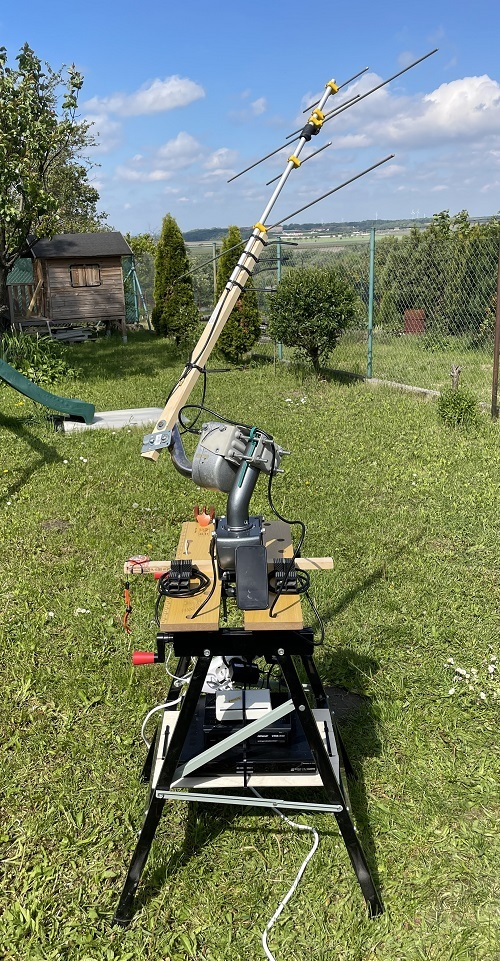

FrankenSaT
==========

FrankenSaT is abbreviation of <b>"Frankenstein" Satellite Tracker</b> - an affordable Azimuth/Elevation (pan/tilt) solution controlled by [Hamlib](https://github.com/Hamlib/Hamlib)'s _rotctld_ protocol. Why "Frankenstein"? Like the [creature of the same name](https://en.wikipedia.org/wiki/Frankenstein%27s_monster) in a [literary novel](https://en.wikipedia.org/wiki/Frankenstein), this project is ultimately ugly - both software and construction.

# Advantages

* **price**: It can be made by anyone who has an old satellite receiver in a drawer with [Enigma2](https://github.com/openatv/enigma2) to control [DiSEqC](https://en.wikipedia.org/wiki/DiSEqC) motors and perhaps a motor for a satellite dish alignment. If not, it can often be found on sale at a lower total price than many other antenna pan/tilt solutions.
* **low skill requirement**: No need to solder, all electronics is already assembled in receiver. All you have to do is upload a Bash script to the receiver and you will get elevation control. The same script can also control two motors.
* carrying capacity: the standard dish is 10 kg. When using two motors, there is still several kg available for the antenna.
* weather proof motors by design
* optimal for "cliff" mount: angular span 150-180° of many motors seems to be enough for Azimuth rotation in such situations (like balcony). However, it is also possible to dynamically adjust the observation per every overflight: the center of the Azimuth motor position should point to Azimuth with maximum Elevation and the same value should be set to FrankenSaT, which recalculates the right Azimuth for that specific observation.

# Disadvantages

* total weight: approx 3-4 kg per motor + antenna
* satellite rotor shaft are not straight but angled (35°? all of them?) - this must be compensated/tolerated while engineering construction
* some motors are not fast enough to track objects in higher Elevation, however those could be still usable for Elevation control
* some motors have too narrow angular span (like 90° instead of 160°), however those are still usable for Elevation control

# Tested receivers

* Amiko Viper Combo (openATV 7.3)
* _coming soon..._
